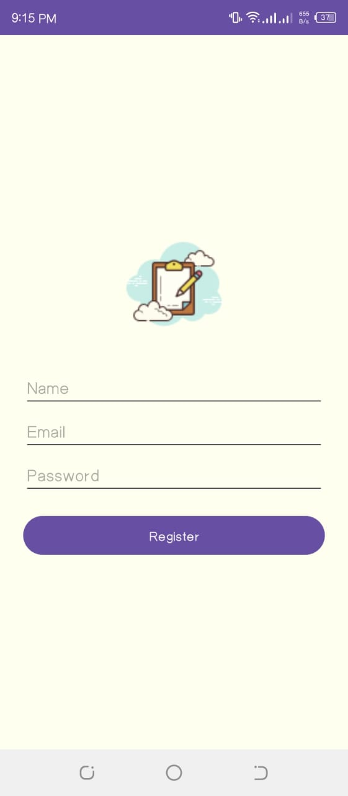

** Personal Task Manager + Firebase Auth (Internship Task 2 & 3) **

## 🔐 Task 3 – Firebase Authentication + Integration

This app includes a secure login and registration system using Firebase Authentication and stores user profiles in Firebase Realtime Database.

## ✅ Features Implemented

Register new user with Email & Password

Save user data (Name, Email, UID) in Realtime Database

Login existing user and fetch user profile

Store last login time in database

Welcome message using session manager

Splash screen checks login status

Logout confirmation dialog

MVVM Architecture using AuthViewModel

SharedPreferences for session management

## 📋 Task 2 – MyTasks: Personal Task Manager App

A clean and efficient task manager that lets users add, update, delete, and organize their personal tasks with priorities, categories, and reminders.

## ✅ Features

Add new task: Title, Description, Date, Time, Priority, Category

View all tasks

Filter tasks: All, Pending, Ongoing, Finished

Edit task (auto-set status to Ongoing)

Delete task with confirmation

Mark task as complete

Reminder using AlarmManager

Category and priority selection

Splash screen + Custom App Icon

MVVM using Room Database + LiveData

## 💡 Technologies Used

Java, XML

Firebase Auth & Realtime DB

Room Database

MVVM Architecture

LiveData, ViewModel

SharedPreferences

AlarmManager + BroadcastReceiver

AndroidX + Material Components

## 🖼️ Screenshots

<h3>👤 Authentication Module (Task 3)</h3>
<table>
  <tr>
    <th>Register</th>
    <th>Login</th>
    <th>Firebase Auth</th>
  </tr>
  <tr>
    <td></td>
    <td></td>
    <td></td>
  </tr>
</table>

<table>
  <tr>
    <th>Realtime DB</th>
    <th>Welcome Message</th>
    <th>Logout Dialog</th>
  </tr>
  <tr>
    <td></td>
    <td></td>
    <td></td>
  </tr>
</table>

<h3>✅ Task Manager App (Task 2)</h3>
<table>
  <tr>
    <th>Splash Screen</th>
    <th>Add Task</th>
    <th>Task List</th>
  </tr>
  <tr>
    <td></td>
    <td></td>
    <td></td>
  </tr>
</table>

<table>
  <tr>
    <th>Category Selection</th>
    <th>Priority Selection</th>
    <th>Time Picker</th>
  </tr>
  <tr>
    <td></td>
    <td></td>
    <td></td>
  </tr>
</table>

<table>
  <tr>
    <th>Calendar Picker</th>
    <th>Delete Confirmation</th>
    <th>Reminder Notification</th>
  </tr>
  <tr>
    <td></td>
    <td></td>
    <td></td>
  </tr>
</table>

<table>
  <tr>
    <th>Finished Tasks</th>
  </tr>
  <tr>
    <td></td>
  </tr>
</table>

## 🚀 How to Run the App

1. Clone or download this repo
   
3. Open in Android Studio

4. Add your google-services.json from Firebase (not included for security)

5. Sync Gradle and build project

6. Run on emulator or device

7. Register/Login and start using Focus Track 🎯

## 🔐 Note on Security

The google-services.json file used to configure Firebase has been excluded from version control for security purposes.
Make sure to download your own file from Firebase Console and place it inside the app/ directory.
